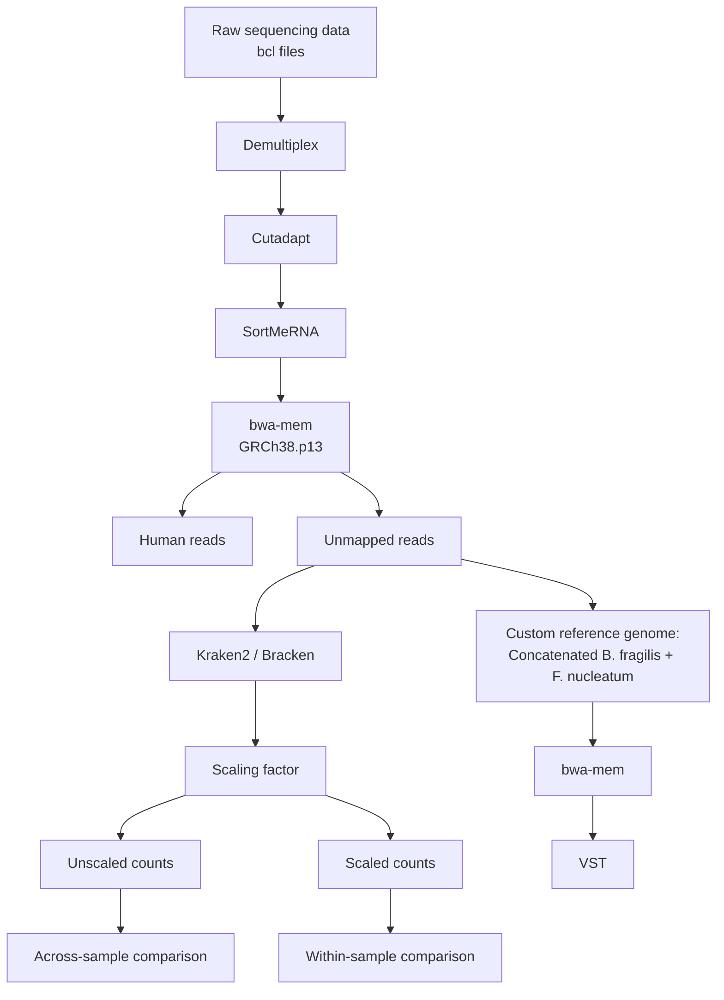
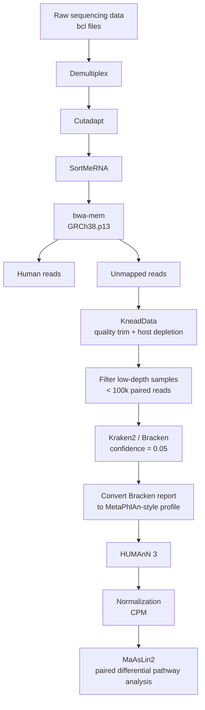

# BMEG 524 Final Project: Metatranscriptomic Analysis of Microbial Reads from Colorectal Cancer Patient Biopsies

Kvich, L. et al. Biofilms and core pathogens shape the tumor microenvironment and immune phenotype in colorectal cancer. Gut Microbes 16, 2350156 (2024). available here: [https://www.tandfonline.com/doi/full/10.1080/19490976.2024.2350156#d1e667](https://www.tandfonline.com/doi/full/10.1080/19490976

This project re-analyzes low-biomass mucosal biopsy RNA-seq data from the colorectal cancer (CRC) study by Kvich et al. in an attempt to recover additional microbial community and functional insights beyond the original study, which primarily focused on the host RNA-seq signal. In this re-analysis, Kvich et al.'s microbial RNA-seq workflow is first reproduced to validate the published findings. The analysis is then extended with additional preprocessing and functional pathway analysis to explore whether more discovery-oriented workflows can reveal microbial signals that were not accessible in the original study.

## Dataset

119 paired-end RNA-seq samples (unmapped reads from human alignment).

- CRC: 40 samples, Paired normal: 39 samples, Healthy: 40 samples
- Read length: ~150 bp (Illumina A00962)

Sample lists: `samples_all.txt` (119), `samples_filtered.txt` (86), `excluded_samples.txt` (33 excluded)

---

### Pre-processed by Kvich et al.: `no_kneaddata/` - all 119 samples
No additional human read removal (reads already from upstream unmapped fraction).

bwa-mem → featureCounts (B. frag + F. nuc reference) → Kraken2 (--confidence 0.05) → Bracken → normalize

HUMANn3 not analysed for this track.

### Re Pre-preprocessed and filtered: `kneaddata/` - subset of 86 samples
33 excluded (Lasse4–33 except Lasse9/20/25; La50, La54, La68, La73, La77, La89).

See `no_kneaddata/README.md` and `kneaddata/README.md` for per-track details.

---

## Directory Structure

```
bmeg524/
├── input/                  → symlink → bfrag4/input (238 FASTQ files)
├── refs/                   → symlink → bfrag3/refs (B. frag + F. nuc genomes + bwa index)
├── dbs/                    → symlink → bfrag4/dbs (hg39 T2T KneadData reference)
├── samples_all.txt
├── samples_filtered.txt
├── excluded_samples.txt
├── scripts/
│   ├── no_kneaddata/       — pipeline scripts for Track 1
│   └── kneaddata/          — pipeline scripts for Track 2
├── no_kneaddata/           — Track 1 outputs
└── kneaddata/              — Track 2 outputs
```

---

## Databases

| Database | Location |
|---|---|
| Kraken2 standard (k2_standard_20260226) | `/arc/project/st-ctropini-1/ahong/databases/kraken2_standard_db/` |
| HUMANn3 ChocoPhlAn | `/home/alicesh/project/ahong/databases/humann_databases/chocophlan` |
| HUMANn3 UniRef90 | `/home/alicesh/project/ahong/databases/humann_databases/uniref` |
| KneadData hg39 T2T | `dbs/human_genome/hg_39` |

## Conda Environments

| Environment | Used for |
|---|---|
| `bfrag4` | KneadData v0.12.4 |
| `kraken_env` | Kraken2, Bracken, normalization scripts |
| `humann3` | HUMANn3 v3.6 |
| `base` | MultiQC |

---

## Kvich et al. workflow



## My workflow



## GenAI Acknowledgement

- OpenAI. (2026). ChatGPT (April 13 version) [Large language model]. https://chatgpt.com/
- Anthropic. (2026). Claude Code (April 13 version) [Large language model]. https://claude.ai/
