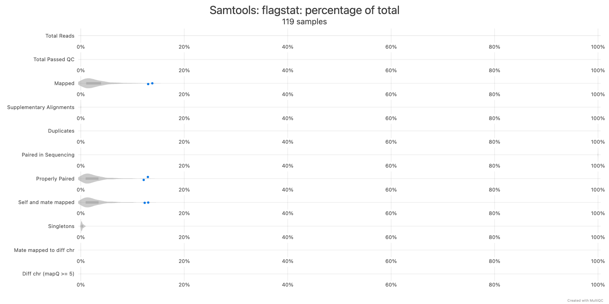
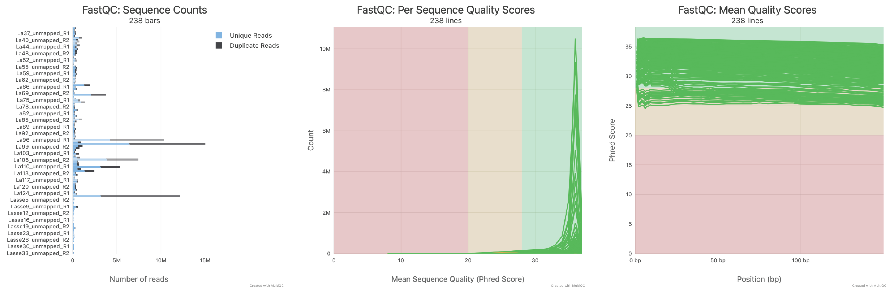
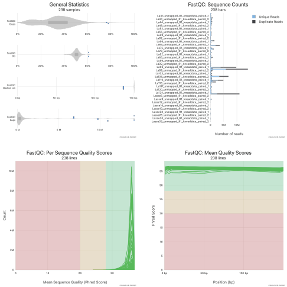

```{r setup, include=FALSE}
knitr::opts_chunk$set(
  echo = FALSE,
  warning = FALSE,
  message = FALSE
)
knitr::opts_knit$set(root.dir = normalizePath("."))
```

```{r libraries, include=FALSE}
library(tidyverse)
library(DESeq2)
library(patchwork)
library(ggrepel)
library(vegan)
library(ggforce)
library(ggsignif)
library(rstatix)
library(Maaslin2)
```

# Introduction

## Background

Characterizing microbial abundance and function from human tissue samples such as biopsies presents substantial challenges for analysis. Unlike stool or cecal samples that contain high microbial biomass, mucosal tissue biopsies contain a low ratio of microbial to host cells, causing sequencing depth to be overwhelmingly dominated by host RNA. Therefore, standard metatranscriptomic workflows optimized for microbe-rich samples are often poorly suited for tissue-based studies. At the same time, tissue-derived samples offer a unique opportunity to simultaneously investigate both host transcriptional responses and the activity of spatially localized microbes at the mucosal interface, where many biologically relevant host-microbe interactions occur. As a result, analytical frameworks must balance efficient recovery of low-abundance microbial transcripts with preservation of host-derived signals that provide critical context for interpreting microbial function in situ.

Marker-based taxonomic classifiers such as [MetaPhlAn 4]( https://pubmed.ncbi.nlm.nih.gov/36823356/) and [mOTUs3]( https://pubmed.ncbi.nlm.nih.gov/36464731/) rely using species-specific marker genes, but when microbial reads make up only a small fraction of the sample, there may not be enough of those reads to detect them reliably. A 2024 benchmarking paper demonstrates this by showing that in synthetic samples containing 97% host cells, marker-based methods achieved recall as low as 0.05-0.15, meaning the vast majority of species present went undetected. ([Pereira-Marques, 2024](https://pmc.ncbi.nlm.nih.gov/articles/PMC10913719/)) This loss of sensitivity at the taxonomic level then carries on into functional profiling, since tools like [HUMAnN 3](https://pmc.ncbi.nlm.nih.gov/articles/PMC8096432/)  depend on accurate species identification to build sample-specific pangenome databases for their nucleotide search step.

To address this, Pereira-Marques et al. proposed a metatranscriptomics strategy specifically tailored for low-biomass samples. ([Pereira-Marques, 2024](https://pmc.ncbi.nlm.nih.gov/articles/PMC10913719/)) Their workflow suggests Kraken 2/Bracken (with the confidence threshold raised to 0.05 to reduce false positives while preserving high recall) with [HUMAnN 3](https://pmc.ncbi.nlm.nih.gov/articles/PMC8096432/) for functional profiling. By feeding the more complete Kraken 2/Bracken taxonomic profile into HUMAnN 3, a greater proportion of reads are captured during the nucleotide search step, reducing reliance on the computationally expensive translated search and improving overall detection of microbial gene families. 

## Overview of original experiment

In their study ['Biofilms and core pathogens shape the tumor microenvironment and immune phenotype in colorectal cancer'](https://www.tandfonline.com/doi/full/10.1080/19490976.2024.2350156#abstract) Kvich et al. investigate the interplay between host tissue and mucosa-associated bacteria in colorectal cancer (CRC) using a dual-RNAseq approach (host) combined with fluorescence in situ hybridization (FISH) microscopy. Mucosal colon biopsies were collected from CRC patients (tumor and paired normal tissue) and healthy controls at Zealand University Hospital, Denmark. FISH was used to visualize bacterial biofilms and to detect B. fragilis and Fusobacterium spp. directly in tissue sections, while RNA sequencing captured both host and microbial transcripts from the same samples.

On the host side, reads were aligned to the human reference genome and used for differential gene expression analysis (DESeq2), pathway enrichment, and immune cell deconvolution using multiple scoring methods. The host RNA-seq analyses revealed that CRC samples with high bacterial activity displayed a pro-inflammatory transcriptomic profile, with enrichment of interleukin-10 signaling, defensins, and chemokine receptor binding pathways, as well as shifts in immune cell infiltration including increased M2 macrophages, regulatory T-cells, and myeloid dendritic cells.

For the microbial component, trimmed reads were classified with Kraken 2/Bracken to determine bacterial community composition, revealing that CRC tissue harbored higher overall bacterial counts and was enriched for Bacteroidota, Fusobacteriota, and Actinobacteria, with F. nucleatum accounting for approximately 79% of Fusobacteria. Additionally, reads that did not map to the human genome were re-aligned to a custom concatenated reference of B. fragilis and F. nucleatum to identify which genes these species were expressing in the tumor microenvironment. The authors reported the top 20 most highly expressed genes for each species, but noted that most were highly conserved housekeeping genes (e.g., tuf, fusA, gap, dnaK, groL) shared across many bacteria, making species-specific functional inference not possible.

## Justification for re-analysis

Kvich et al.'s analysis of the microbial transcriptome was limited in scope. For functional characterization, unmapped (non-human) reads were aligned to only two representative reference genomes, B. fragilis and F. nucleatum, rather than being profiled against a comprehensive database. This approach is not standard practice in metatranscriptomics as it risks misattributing reads from closely related species to the two chosen references, and it discards transcriptional information from the broader microbial community entirely. The authors acknowledged that the results were largely uninformative, as the most highly expressed genes were conserved across many bacterial species. Notably, no justification was provided for why a community-wide functional profiling approach was not pursued.

Tools such as HUMAnN 3, particularly when combined with optimized Kraken 2/Bracken as proposed above, are specifically designed for this type of analysis. They provide both community-wide functional profiling and species-resolved pathway analysis simultaneously, enabling a far more comprehensive view of microbial activity in the tumor microenvironment. Given that the Kvich et al. dataset comprises approximately 90 deeply sequenced mucosal biopsy samples from CRC, paired normal, and healthy tissues (the type of low-biomass samples the Pereira-Marques workflow was validated for) there is a clear opportunity to re-analyze this data using standard metatranscriptomic methods. Such a re-analysis could reveal functional contributions from the broader microbial community and species-resolved pathway differences between CRC and healthy tissue that the original two-genome approach could not detect.

## Overview of methods

This re-analysis is structured in three stages. First, the Kvich et al. microbial analysis is reproduced on the raw unmapped reads to confirm that our pipeline produces similar results as the published paper. Second, additional pre-processing, including quality trimming and human read decontamination using KneadData, is applied to the same reads. Its effect on sample depth and community composition is benchmarked against the baseline, and low-read-depth samples are excluded. Third, functional profiling with HUMANn3 is performed on the KneadData-cleaned reads (84 samples); this analysis was not attempted by the original authors.

# Dataset

Sequencing data containing human reads were not shraed by Kvich et al. due to public health information reasons. Instead, a subset of the deeply sequenced RNA-seq data was shared upon agreement between Lasse Kvich, Blaine Gabriel Fritz, and Carolina Tropini. These reads are 
unmapped reads that did not align to GRCh38. The upstream pipeline consisted of adapter trimming with Cutadapt, ribosomal RNA removal with SortMeRNA, and alignment to GRCh38 with bwa-mem v0.7.17. The unmapped fraction was provided as 119 paired-end samples, named `{sample}_unmapped_R1.fq` / `{sample}_unmapped_R2.fq` (238 files total, read length ~150 bp, sequencer Illumina A00962). Metadata was obtained from Kvich and Fritz as well.

There are three biological groups:

| Group | Samples | Description |
|---|---|---|
| CRC | La__ samples | Tumor biopsies from CRC patients |
| Paired normal | La__ samples | Paired normal tissue from the same CRC patients |
| Healthy control | Lasse__ samples | Mucosal biopsies from healthy individuals |

All sample names are listed in `samples_all.txt` (119 samples). After KneadData filtering (Part 2), the 86 retained samples are listed in `samples_filtered.txt`.

# Computational Environment

All compute jobs were run on the UBC ARC Sockeye HPC cluster using SLURM. Scripts for Parts 1 and 3a are in `scripts/no_kneaddata/`; scripts for Parts 2 and 3b are in `scripts/kneaddata/`. Each directory is numbered in execution order. Per-sample steps were submitted as SLURM array jobs.

**Databases:**

| Database | Version |
|---|---|---|
| Kraken2 standard | k2_standard_20260226 |
| KneadData human reference | T2T-CHM13v2.0 (hg39) |
| HUMANn3 nucleotide | ChocoPhlAn (full) |
| HUMANn3 protein | UniRef90 |

The Kraken2 standard database was downloaded as below:

```bash
cd /scratch/st-ctropini-1/ahong/kraken2_standard_db
wget -c https://genome-idx.s3.amazonaws.com/kraken/k2_standard_20260226.tar.gz \
    -O kraken2_standard.tar.gz
tar -xzf kraken2_standard.tar.gz
```

# Part 1: Reproducing the Kvich et al. Microbial Analysis

The unmapped reads were used directly, without additional pre-processing, to reproduce the original microbial analyses. This establishes a baseline to compare with the published results before any methodological changes are introduced.

Scripts: `scripts/no_kneaddata/01_align_bwa.sh` through `07_normalize_bracken.py`
Local output: `no_kneaddata/`

## 1.1 Reference genome preparation

Reference genomes for *Bacteroides fragilis* (GCF_003019295.1) and *Fusobacterium nucleatum* (GCF_016889925.1) were downloaded from NCBI. The FASTA sequences and GTF annotation files were concatenated into a single combined reference, then indexed with bwa.

```bash
cat refs/GCF_003019295.1/GCF_003019295.1_ASM301929v1_genomic.fna \
    refs/GCF_016889925.1/GCF_016889925.1_ASM1688992v1_genomic.fna \
    > refs/combined/combined_bfrag_fnuc.fna

cat refs/GCF_003019295.1/GCF_003019295.1_ASM301929v1_genomic.gtf \
    refs/GCF_016889925.1/GCF_016889925.1_ASM1688992v1_genomic.gtf \
    > refs/combined/combined_bfrag_fnuc.gtf

bwa index refs/combined/combined_bfrag_fnuc.fna
```

Chromosome assignments in the combined reference:

| Chromosome | Organism |
|---|---|
| `NZ_CP069563.1` | *Bacteroides fragilis* (locus tag prefix `I6J55_RS`) |
| `NZ_CP028101.1` | *Fusobacterium nucleatum* (locus tag prefix `C7Y58_RS`) |

## 1.2 Alignment to bacterial references (script: 01_align_bwa.sh)

Paired-end reads from all 119 samples were aligned to the combined reference with bwa-mem v0.7.19. SLURM array: 119 tasks, 8 CPUs, 64 GB RAM, 24 h.

```bash
bwa mem \
    -t 8 \
    -R "@RG\tID:{sample}\tSM:{sample}\tLB:{sample}\tPL:ILLUMINA" \
    refs/combined/combined_bfrag_fnuc.fna \
    input/{sample}_unmapped_R1.fq \
    input/{sample}_unmapped_R2.fq \
  | samtools sort -@ 8 -o output/bam/{sample}.bam

samtools index output/bam/{sample}.bam
```

BAMs are on the server only (`/scratch/st-ctropini-1/ahong/bfrag3/output/bam/`) and are not included in this repository due to file size.

## 1.3 Alignment QC (script: 02_flagstat.sh)

`samtools flagstat` was run per sample; results were aggregated into a MultiQC report. SLURM array: 119 tasks, 2 CPUs, 8 GB RAM, 1 h.

```bash
# Per sample
samtools flagstat \
    -@ 2 \
    output/bam/{sample}.bam \
    > output/qc/flagstat/{sample}.flagstat

# MultiQC aggregation
multiqc output/qc/flagstat \
    --outdir output/qc/multiqc \
    --filename bwa_alignment_qc
```

Per-sample flagstat files: `no_kneaddata/qc/flagstat/` (119 files).   
MultiQC report: `no_kneaddata/qc/multiqc/bwa_alignment_qc.html`.    


   

**Figure1.** Samtools flagstat alignment summary    

Mapping of the non-human read fraction to the combined B. fragilis + F. nucleatum reference was generally low, which is expected given that all reads were aligned to only two bacterial species. Most samples showed minimal alignment, with a mean mapping rate of approximately 2.8%. However, a small subset of high-depth samples showed notably higher mapping rates, including La70 (13.8%), La122 (12.95%), and La110 (10.64%). These samples also had among the highest total non-human read counts. Because these values represent percentages rather than absolute read counts, their enrichment in some of the highest-depth libraries may suggest sample-specific biological dominance by these species or, alternatively, technical artifacts affecting the unusually deep samples. The flagstat summary additionally showed that the majority of mapped reads were properly paired, indicating that the alignments were structurally consistent despite the overall low mapping fraction.

## 1.4 Gene expression quantification (script: 03_featurecounts.sh)

featureCounts quantified per-gene read counts across all 119 BAMs simultaneously. Single SLURM job: 8 CPUs, 32 GB RAM, 24 h.

```bash
featureCounts \
    -p -B -C \
    -T 8 \
    -a refs/combined/combined_bfrag_fnuc.gtf \
    -F GTF -t CDS -g gene_id \
    -o output/counts/counts.txt \
    output/bam/*.bam
```

Key flags: `-p` paired-end; `-B` requires both mates to map; `-C` discards chimeric pairs; `-t CDS` required because NCBI bacterial GTFs annotate protein-coding genes as `CDS` features, not `exon`.

Output: `no_kneaddata/alignment/counts/counts.txt` -- gene x sample raw read count matrix.

## 1.5 Gene annotations (script: 03b_make_gene_annotations.py)

A gene annotation table was generated from the combined GTF by irst collecting `product` descriptions from `CDS` feature lines into a `gene_id -> product` dictionary, then joining to each `gene` feature line. This is required because `product` is a CDS-level attribute in NCBI bacterial GTFs, not a gene-level attribute.

```bash
python scripts/no_kneaddata/03b_make_gene_annotations.py \
    refs/combined/combined_bfrag_fnuc.gtf \
    > no_kneaddata/alignment/gene_annotations.tsv
```

Output: `no_kneaddata/alignment/gene_annotations.tsv` -- columns: `gene_id`, `gene` (short name), `product`.

## 1.6 Taxonomic profiling with Kraken2 (script: 04_kraken2.sh)

Kraken2 was run on the raw unmapped reads with `--confidence 0.05`, as recommended by Pereira-Marques et al. for low-biomass samples. 
SLURM array: 119 tasks, 8 CPUs, 100 GB RAM, 24 h. Classified reads discarded (`--output /dev/null`) to save disk space.

```bash
kraken2 \
    --db /scratch/st-ctropini-1/ahong/kraken2_standard_db \
    --threads 8 --paired --confidence 0.05 \
    --report output/kraken2_conf0.05/{sample}.report \
    --output /dev/null \
    input/{sample}_unmapped_R1.fq input/{sample}_unmapped_R2.fq
```

Output: `no_kneaddata/community_composition/kraken2/{sample}.report` (119 files).

## 1.7 Abundance estimation with Bracken (script: 05_bracken.sh)

Bracken redistributes reads assigned to higher taxonomic levels back to species. SLURM array: 119 tasks, 4 CPUs, 16 GB RAM, 4 h.

```bash
bracken \
    -d /scratch/st-ctropini-1/ahong/kraken2_standard_db \
    -i output/kraken2_conf0.05/{sample}.report \
    -o output/bracken_conf0.05/{sample}.bracken \
    -w output/bracken_conf0.05/{sample}_bracken.report \
    -r 150 -l S
```

Output: `no_kneaddata/community_composition/bracken/` -- 238 files (`.bracken` + `_bracken.report`, 2 per sample).

## 1.8 Normalize Bracken counts (script: 07_normalize_bracken.py)

Species-level counts were normalized following Kvich et al.:

1. Read counts per sample from raw R1 FASTQ (`wc -l / 4`)
2. Scaling factor = `min_reads_across_samples / reads_in_sample`
3. Scaled counts = Bracken `new_est_reads` x scaling factor
4. Taxa with `log10(scaled_count + 1) < 0.9` in all samples removed (~8 reads; from Kvich et al. Figure S1)

```bash
python scripts/no_kneaddata/07_normalize_bracken.py
```

Output in `no_kneaddata/community_composition/normalized/`: `counts_unscaled.tsv`, `counts_scaled.tsv`, `counts_filtered.tsv`, `scaling_factors.tsv`.

## 1.9 Results: Community composition and gene expression

Community composition results are shown for the raw reads here, reproducing Kvich et al.'s analysis. 

- Gene expression results were used for Figure 2 (Figure S6 in paper), and table 4 (Table S2 in apepr). As a reminder, these are from BWA alignment and featureCounts, which were applied to the raw reads
- Abundance data from Kraken2/Bracken was used to plot FIgure 3 (Figure 2J in paper), and Figure 4 (Also Figure 4 in paper)

```{r load-data}
BFRAG_CHR  <- "NZ_CP069563.1"
FNUC_CHR   <- "NZ_CP028101.1"
type_levels <- c("CRC", "Healthy", "Paired")

# read meta data
meta <- read.delim("meta.tsv") %>%
  mutate(sample_id = as.numeric(str_remove(sample, "^[A-Za-z]+")))
paired_meta <- meta %>% filter(type %in% c("Paired", "CRC"))

# Function to fix inconsistent naming (Lasse to La)
rename_lasse <- function(df) {colnames(df) <- colnames(df) %>% str_replace("^Lasse(\\d+)$", "La\\1")
  df}

# Flagstat contains total fragments per sample (read1 line)
parse_flagstat <- function(file) {
  lines <- readLines(file)
  data.frame(sample = tools::file_path_sans_ext(basename(file)), total_fragments = as.numeric(str_extract(grep("read1", lines, value = TRUE)[1], "^\\d+")))}

flagstat_df <- list.files("no_kneaddata/qc/flagstat", pattern = "\\.flagstat$", full.names = TRUE) %>%
  map_dfr(parse_flagstat) %>%
  mutate(sample = str_replace(sample, "^Lasse(\\d+)$", "La\\1"))

# featureCounts matrix
counts_raw <- read.delim("no_kneaddata/alignment/counts/counts.txt", skip = 1, check.names = FALSE)
colnames(counts_raw) <- colnames(counts_raw) %>%
  str_replace(".*/", "") %>% str_replace("\\.bam$", "") %>%
  str_replace("^Lasse(\\d+)$", "La\\1")
sample_cols <- setdiff(colnames(counts_raw), c("Geneid", "Chr", "Start", "End", "Strand", "Length"))

bfrag_counts <- counts_raw %>% filter(Chr == BFRAG_CHR) %>% select(all_of(sample_cols)) %>% colSums()
fnuc_counts  <- counts_raw %>% filter(Chr == FNUC_CHR)  %>% select(all_of(sample_cols)) %>% colSums()

reads_df <- flagstat_df %>%
  left_join(tibble(sample = names(bfrag_counts), bfrag = bfrag_counts), by = "sample") %>%
  left_join(tibble(sample = names(fnuc_counts),  fnuc  = fnuc_counts),  by = "sample") %>%
  mutate(across(c(bfrag, fnuc), replace_na, 0), unmapped = pmax(total_fragments - bfrag - fnuc, 0))

# Normalized Bracken counts, as described by authors
counts_scaled   <- read.delim("no_kneaddata/community_composition/normalized/counts_scaled.tsv",row.names = 1, check.names = FALSE) %>% rename_lasse()
counts_unscaled <- read.delim("no_kneaddata/community_composition/normalized/counts_unscaled.tsv",row.names = 1, check.names = FALSE) %>% rename_lasse()
keep <- intersect(colnames(counts_scaled), meta$sample)
counts_scaled   <- counts_scaled[, keep]
counts_unscaled <- counts_unscaled[, keep]

sf_df <- read.delim("no_kneaddata/community_composition/normalized/scaling_factors.tsv") %>%
  mutate(sample = str_replace(sample, "^Lasse(\\d+)$", "La\\1"))

# KneadData normalized Bracken counts (86 samples)
counts_scaled_kd   <- read.delim("kneaddata/community_composition/normalized/counts_scaled.tsv", row.names = 1, check.names = FALSE)
counts_unscaled_kd <- read.delim("kneaddata/community_composition/normalized/counts_unscaled.tsv", row.names = 1, check.names = FALSE)
keep_kd <- intersect(colnames(counts_scaled_kd), meta$sample)
counts_scaled_kd   <- counts_scaled_kd[, keep_kd]
counts_unscaled_kd <- counts_unscaled_kd[, keep_kd]
sf_df_kd <- read.delim("kneaddata/community_composition/normalized/scaling_factors.tsv")
```

```{r shared-prep}
# Format p-values for plot annotations
fmt_p <- function(p) ifelse(p < 0.001, sprintf("p = %.2e", p), sprintf("p = %.4f", p))
# Ensure sample groups always appear in the same order in plots
to_factor <- function(df) mutate(df, type = factor(type, levels = type_levels))

# Raw reads version (n = 119)
# Total bacterial scaled counts per sample
total_per_sample <- colSums(counts_scaled)
# Make a plotting dataframe for total bacterial abundance per sample and attach sample metadata (CRC/Healthy/Paired)
total_df <- enframe(total_per_sample, name = "sample", value = "total_scaled") %>%
  left_join(meta, by = "sample") %>% filter(!is.na(type))
# Calculate alpha diversity (Shannon index) for each sample using unscaled counts, then attach metadata
shannon_df <- diversity(t(counts_unscaled), index = "shannon") %>%
  enframe(name = "sample", value = "shannon") %>%
  left_join(meta, by = "sample") %>% filter(!is.na(type))
# Sum all species whose names start with "Fusobacterium " to get total Fusobacterium counts per sample
fuso_phylum_df <- colSums(counts_scaled[grepl("^Fusobacterium ", rownames(counts_scaled)), ]) %>%
  enframe(name = "sample", value = "fusobacteria") %>%
  left_join(meta, by = "sample") %>% filter(!is.na(type))
# Extract scaled counts for B. fragilis and F. nucleatum only, then calculate their relative abundance within each sample
species_df <- data.frame(
  sample = colnames(counts_scaled),
  `Bacteroides fragilis` = as.numeric(counts_scaled["Bacteroides fragilis", ]),
  `Fusobacterium nucleatum` = as.numeric(counts_scaled["Fusobacterium nucleatum", ]),
  check.names = FALSE) %>%
  left_join(meta, by = "sample") %>% filter(!is.na(type)) %>%
  mutate(bfrag_rel = `Bacteroides fragilis`    / total_per_sample[sample], fnuc_rel  = `Fusobacterium nucleatum` / total_per_sample[sample])
# Convert the species-relative-abundance dataframe to long format for plotting and create a combined factor that controls x-axis order in the final panel
rel_long <- species_df %>%
  select(sample, type, bfrag_rel, fnuc_rel) %>%
  pivot_longer(c(bfrag_rel, fnuc_rel), names_to = "species", values_to = "rel") %>%
  mutate(species = recode(species, bfrag_rel = "B. fragilis", fnuc_rel = "F. nucleatum"),
         group = interaction(species, type, sep = "\n"),
         group = factor(group, levels = c(
           "B. fragilis\nCRC",  "B. fragilis\nHealthy",  "B. fragilis\nPaired",
           "F. nucleatum\nCRC", "F. nucleatum\nHealthy", "F. nucleatum\nPaired")))

# KneadData versions (86 samples)
# Total bacterial scaled counts per sample after KneadData
total_per_sample_kd <- colSums(counts_scaled_kd)
# Plotting dataframe for total bacterial abundance after KneadData
total_df_kd <- enframe(total_per_sample_kd, name = "sample", value = "total_scaled") %>%
  left_join(meta, by = "sample") %>% filter(!is.na(type))
# Shannon diversity per sample after KneadData
shannon_df_kd <- diversity(t(counts_unscaled_kd), index = "shannon") %>%
  enframe(name = "sample", value = "shannon") %>%
  left_join(meta, by = "sample") %>% filter(!is.na(type))
# Total Fusobacterium counts per sample after KneadData
fuso_phylum_df_kd <- colSums(counts_scaled_kd[grepl("^Fusobacterium ", rownames(counts_scaled_kd)), ]) %>%
  enframe(name = "sample", value = "fusobacteria") %>%
  left_join(meta, by = "sample") %>% filter(!is.na(type))
# Extract B. fragilis and F. nucleatum scaled counts after KneadData and calculate their relative abundance within each sample
species_df_kd <- data.frame(
  sample = colnames(counts_scaled_kd),
  `Bacteroides fragilis` = as.numeric(counts_scaled_kd["Bacteroides fragilis", ]),
  `Fusobacterium nucleatum` = as.numeric(counts_scaled_kd["Fusobacterium nucleatum", ]),
  check.names = FALSE) %>%
  left_join(meta, by = "sample") %>% filter(!is.na(type)) %>%
  mutate(bfrag_rel = `Bacteroides fragilis` / total_per_sample_kd[sample], fnuc_rel  = `Fusobacterium nucleatum` / total_per_sample_kd[sample])
# Long-format version for plotting relative abundance after KneadData
rel_long_kd <- species_df_kd %>%
  select(sample, type, bfrag_rel, fnuc_rel) %>%
  pivot_longer(c(bfrag_rel, fnuc_rel), names_to = "species", values_to = "rel") %>%
  mutate(species = recode(species, bfrag_rel = "B. fragilis", fnuc_rel = "F. nucleatum"),
         group = interaction(species, type, sep = "\n"),
         group = factor(group, levels = c(
           "B. fragilis\nCRC",  "B. fragilis\nHealthy",  "B. fragilis\nPaired",
           "F. nucleatum\nCRC", "F. nucleatum\nHealthy", "F. nucleatum\nPaired")))
```

### Figure S6 recreation - Non-human read mapping per sample

Figure S6 was recreated to visualize how much of each sample’s non-human read fraction could be assigned to the two-species reference (B. fragilis + F. nucleatum) and to justify the >1M read threshold used for downstream gene-level analyses. This helps identify the subset of high-depth samples in which the two target species contribute a substantial fraction of the non-human read pool.

```{r fig-s6, fig.width=14, fig.height=5}
fill_scale <- scale_fill_manual(name   = "Mapping", values = c("B. fragilis" = "#A0522D", "F. nucleatum" = "#1B6CA8", "Unmapped" = "#BEBEBE"))

sort_by_total <- function(df) {order <- df %>% group_by(sample) %>%
    summarise(t = sum(reads_M), .groups = "drop") %>% arrange(t) %>% pull(sample)
  mutate(df, sample = factor(sample, levels = order))}

reads_long <- reads_df %>%
  left_join(meta %>% select(sample, type), by = "sample") %>% filter(!is.na(type)) %>%
  pivot_longer(c(bfrag, fnuc, unmapped), names_to = "mapping", values_to = "reads") %>%
  mutate(reads_M  = reads / 1e6,
         mapping  = factor(mapping, levels = c("bfrag", "fnuc", "unmapped"),
                           labels = c("B. fragilis", "F. nucleatum", "Unmapped")))

p_s6a <- reads_long %>% sort_by_total() %>%
  ggplot(aes(x = sample, y = reads_M, fill = mapping)) +
  geom_col(width = 1) + geom_hline(yintercept = 1, linetype = "dashed") +
  fill_scale + scale_y_continuous(expand = expansion(mult = c(0, 0.05))) +
  labs(x = "Sample", y = "Non-Human Reads (M)", title = "A  All samples") +
  theme_classic() + theme(axis.text.x = element_blank(), axis.ticks.x = element_blank())

p_s6b <- reads_long %>% group_by(sample) %>% filter(sum(reads_M) > 1) %>% ungroup() %>%
  sort_by_total() %>%
  ggplot(aes(x = sample, y = reads_M, fill = mapping)) +
  geom_col() + fill_scale + scale_y_continuous(expand = expansion(mult = c(0, 0.05))) +
  labs(x = "Sample", y = "Non-Human Reads (M)", title = "B  Samples with >1M reads") +
  theme_classic() + theme(axis.text.x = element_text(angle = 45, hjust = 1))

p_s6a + p_s6b + plot_layout(guides = "collect")
```
**Figure 2.** Bacterial gene expression in CRC samples. 

(A) Stacked bar plot of all 119 samples showing reads mapped to B. fragilis, F. nucleatum, and unmapped reads, sorted by total depth. Dashed line indicates 1M reads. (B) Subset of samples exceeding 1M total non-human reads. Read depth distribution and mapping proportions are consistent with those reported by the original authors, confirming that our pipeline reproduces their baseline results.

### Table S2 recreation -Top 20 expressed genes per organism (CRC samples, >=1M reads)

The goal of recreating Table S2 was to validate that the reproduced alignment and gene-counting workflow recovered the same dominant species-specific expression patterns reported by Kvich et al. Using the original supplemental criteria, CRC samples with >=1M non-human reads were retained, gene counts were normalized with DESeq2 variance-stabilizing transformation (VST), expression was averaged across passing samples, and only protein-coding genes with annotated products were included in the final ranked table.

```{r table-s2, results='asis'}
# Load gene annotation table and remove genes without a named product
gene_annot <- read.delim("no_kneaddata/alignment/gene_annotations.tsv") %>% filter(product != "")
# Identify CRC samples with at least 1 million total fragments, matching the filtering criterion described by Kvich et al.
crc_1M <- reads_df %>%
  left_join(meta %>% select(sample, type), by = "sample") %>%
  filter(type == "CRC", total_fragments >= 1e6) %>% pull(sample)
# Build a count matrix containing only passing CRC samples (Rows = genes, columns = samples)
counts_mat <- counts_raw %>%
  column_to_rownames("Geneid") %>%
  select(all_of(sample_cols)) %>%
  select(any_of(crc_1M)) %>%
  mutate(across(everything(), as.integer))
# Minimal DESeq2 sample metadata required for VST normalization
coldata <- data.frame(row.names = colnames(counts_mat), sample = colnames(counts_mat))
# Function to compute mean variance-stabilized expression for a given set of gene IDs across CRC samples
run_vst <- function(gene_ids) {mat <- counts_mat[rownames(counts_mat) %in% gene_ids, ]  # subset to genes from one organism
  mat <- mat[rowSums(mat) > 0, ] # remove genes with zero counts across all samples
  dds <- DESeqDataSetFromMatrix(mat, colData = coldata, design = ~ 1)  # apply DESeq2 variance stabilizing transformation
  rowMeans(assay(varianceStabilizingTransformation(dds, blind = TRUE)))} # return average VST expression across samples
bfrag_avg <- run_vst(counts_raw %>% filter(Chr == BFRAG_CHR) %>% pull(Geneid)) # Compute average VST-normalized expression separately for B. fragilis and F. nucleatum genes
fnuc_avg  <- run_vst(counts_raw %>% filter(Chr == FNUC_CHR)  %>% pull(Geneid))
# Function to convert average expression values into a ranked top-20 table
make_top20 <- function(avg_expr, species_label) {data.frame(gene_id = names(avg_expr), avg_vst = avg_expr) %>%
    inner_join(gene_annot, by = "gene_id") %>%
    arrange(desc(avg_vst)) %>% slice_head(n = 20) %>%
    transmute(Species = species_label, Gene = gene, Product = product, Avg_VST = round(avg_vst, 2))}
# Combine the top 20 expressed genes from both organisms
table_s2 <- bind_rows(make_top20(bfrag_avg, "B. fragilis"), make_top20(fnuc_avg,  "F. nucleatum"))
knitr::kable(table_s2, caption = "Top 20 expressed genes per organism in CRC samples with >=1M reads.")
```

The reproduced top expressed genes were highly similar to those reported in the original study, with both species dominated by conserved housekeeping and central metabolic genes.

### Figure 2J recreation - Virulence gene expression vs F. nucleatum abundance

The goal of recreating Figure 2J was to validate that the reproduced workflow captured the published relationship between F. nucleatum abundance and expression of the virulence-associated genes fomA and radD. This serves as a gene-level reproduction check that links species abundance estimates from Bracken with featureCounts-derived expression values from the same samples.

```{r fig-2j, fig.width=5, fig.height=2.2}
FOMA_ID <- "C7Y58_RS03545"
RADD_ID <- "C7Y58_RS00155"
# Extract raw featureCounts counts for fomA and radD across all samples, convert to long format, and apply the same sequencing-depth scaling used for Bracken abundance estimates
vir_counts <- counts_raw %>%
  filter(Geneid %in% c(FOMA_ID, RADD_ID)) %>%
  select(Geneid, all_of(sample_cols)) %>%
  pivot_longer(-Geneid, names_to = "sample", values_to = "raw_count") %>%
  left_join(sf_df %>% select(sample, scaling_factor), by = "sample") %>%
  mutate(scaled_count = raw_count * scaling_factor, gene = case_when(Geneid == FOMA_ID ~ "fomA", Geneid == RADD_ID ~ "radD"))
# Extract F. nucleatum abundance from the scaled Bracken table
fnuc_row <- which(rownames(counts_scaled) == "Fusobacterium nucleatum")
fnuc_abund <- tibble(sample = colnames(counts_scaled), fnuc_scaled = as.numeric(counts_scaled[fnuc_row, ]))
# Combine virulence gene expression, F. nucleatum abundance, and sample metadata
# Keep only samples with known group labels and non-missing abundance values
# Label the top 5% highest-F. nucleatum samples on the plot
plot_df <- vir_counts %>%
  left_join(fnuc_abund, by = "sample") %>%
  left_join(meta %>% select(sample, type), by = "sample") %>%
  filter(!is.na(type), !is.na(fnuc_scaled)) %>%
  group_by(gene) %>%
  mutate(label = ifelse(fnuc_scaled > quantile(fnuc_scaled, 0.95), sample, NA_character_)) %>%
  ungroup()
# Plot expression of fomA and radD against total F. nucleatum abundance
# Each point is one sample, coloured by sample group
ggplot(plot_df, aes(x = fnuc_scaled, y = scaled_count, colour = type)) +
  geom_point(alpha = 0.7, size = 2) +
  geom_text_repel(aes(label = label), size = .5, max.overlaps = 20, show.legend = FALSE) +
  facet_wrap(~ gene, scales = "free_y") +
  scale_colour_manual(values = c("CRC" = "#E41A1C", "Healthy" = "#4DAF4A", "Paired" = "#377EB8"),name = "Sample type") +
  labs(x = "F. nucleatum abundance (Bracken scaled counts)", y = "Virulence gene expression\n(featureCounts scaled counts)") +
  theme_classic() +
  theme(axis.title = element_text(size = 7),
  axis.text = element_text(size = 7),
  strip.text = element_text(size = 7),
  legend.title = element_text(size = 7),
  legend.text = element_text(size = 7))
```

**Figure 3.** fomA and radD vs F. nucleatum abundance. 

Both fomA and radD expression increased in samples with high F. nucleatum abundance, with a small number of CRC samples driving most of the signal. This is similar to the original Figure 2J.

### Figure 4 recreation - Community composition by sample group

```{r fig4-plots, echo=FALSE, fig.width=5, fig.height=5.5, warning=FALSE, message=FALSE}
# Helper functions for two-sided CRC vs Healthy and paired CRC vs Paired testing
paired_w2 <- function(df, col) {df %>%
    filter(type %in% c("CRC", "Paired")) %>%
    select(patient_ID, type, all_of(col)) %>%
    pivot_wider(names_from = type, values_from = all_of(col)) %>%
    drop_na() %>%
    summarise(p = wilcox.test(CRC, Paired, paired = TRUE)$p.value) %>%
    pull(p)}

paired_t2 <- function(df, col) {df %>%
    filter(type %in% c("CRC", "Paired")) %>%
    select(patient_ID, type, all_of(col)) %>%
    pivot_wider(names_from = type, values_from = all_of(col)) %>%
    drop_na() %>%
    summarise(p = t.test(CRC, Paired, paired = TRUE)$p.value) %>%
    pull(p)}

ind_w2 <- function(df, col) {wilcox.test(
    df[[col]][df$type == "CRC"],
    df[[col]][df$type == "Healthy"])$p.value}

ind_t2 <- function(df, col) {t.test(
    df[[col]][df$type == "CRC"],
    df[[col]][df$type == "Healthy"])$p.value}

# Calculate panel-wise adjusted p-values for one dataset
calc_fig4_stats <- function(total, shannon, fuso, species) {
  list(
    qA   = p.adjust(c(ind_w2(total,   "total_scaled"), paired_w2(total,   "total_scaled"))),
    qB   = p.adjust(c(ind_t2(shannon, "shannon"),      paired_t2(shannon, "shannon"))),
    qC   = p.adjust(c(ind_w2(fuso,    "fusobacteria"), paired_w2(fuso,    "fusobacteria"))),
    qD_b = p.adjust(c(ind_w2(species, "bfrag_rel"),    paired_w2(species, "bfrag_rel"))),
    qD_f = p.adjust(c(ind_w2(species, "fnuc_rel"),     paired_w2(species, "fnuc_rel"))))}

# Enforce consistent group ordering for both datasets
total_df       <- to_factor(total_df)
shannon_df     <- to_factor(shannon_df)
fuso_phylum_df <- to_factor(fuso_phylum_df)
species_df     <- to_factor(species_df)
rel_long       <- mutate(rel_long, type = factor(type, levels = type_levels))

total_df_kd       <- to_factor(total_df_kd)
shannon_df_kd     <- to_factor(shannon_df_kd)
fuso_phylum_df_kd <- to_factor(fuso_phylum_df_kd)
species_df_kd     <- to_factor(species_df_kd)
rel_long_kd       <- mutate(rel_long_kd, type = factor(type, levels = type_levels))

# Compute improved stats for raw and KneadData-cleaned versions
stats_raw <- calc_fig4_stats(total_df, shannon_df, fuso_phylum_df, species_df)
stats_kd  <- calc_fig4_stats(total_df_kd, shannon_df_kd, fuso_phylum_df_kd, species_df_kd)
make_fig4_panels <- function(total, shannon, fuso, rel, stats, main_title){
  base_theme <- theme_classic(base_size = 7)

  pA <- ggplot(total, aes(x = type, y = total_scaled / 1e6)) +
    geom_boxplot(outlier.shape = NA) +
    geom_jitter(width = 0.2, size = 0.5) +
    geom_signif(comparisons = list(c("CRC", "Healthy"), c("CRC", "Paired")),
      annotations = fmt_p(stats$qA),
      step_increase = 0.12, tip_length = 0.02, textsize = 2) +
    ylim(0, max(total$total_scaled / 1e6) * 1.3) +
    labs(x = NULL, y = "Scaled Counts (x10^6)", title = "A  Bacterial scaled counts") + base_theme

  pB <- ggplot(shannon, aes(x = type, y = shannon)) +
    geom_boxplot(outlier.shape = NA) +
    geom_jitter(width = 0.2, size = 0.5) +
    geom_signif(comparisons = list(c("CRC", "Healthy"), c("CRC", "Paired")),
      annotations = fmt_p(stats$qB),
      step_increase = 0.1, tip_length = 0.02, textsize = 2) +
    ylim(0, max(shannon$shannon) * 1.3) +
    labs(x = NULL, y = "Shannon Index", title = "B  Alpha diversity") +
    base_theme

  pC <- ggplot(fuso, aes(x = type, y = fusobacteria)) +
    geom_boxplot(outlier.shape = NA) +
    geom_jitter(width = 0.2, size = 0.5) +
    geom_signif(comparisons = list(c("CRC", "Healthy"), c("CRC", "Paired")),
      annotations = fmt_p(stats$qC), step_increase = 0.12, tip_length = 0.02, textsize = 2) +
    ylim(0, max(fuso$fusobacteria) * 1.3) +
    labs(x = NULL, y = "Scaled Counts", title = "C  Fusobacterium counts") +
    base_theme

  pD <- ggplot(rel, aes(x = group, y = rel)) +
    geom_boxplot(outlier.shape = NA) +
    geom_jitter(width = 0.2, size = 0.5) +
    geom_signif(comparisons = list(
        c("B. fragilis\nCRC", "B. fragilis\nHealthy"),
        c("B. fragilis\nCRC", "B. fragilis\nPaired"),
        c("F. nucleatum\nCRC", "F. nucleatum\nHealthy"),
        c("F. nucleatum\nCRC", "F. nucleatum\nPaired")),
      annotations = fmt_p(c(stats$qD_b[1], stats$qD_b[2], stats$qD_f[1], stats$qD_f[2])),
      step_increase = 0.1, tip_length = 0.02, textsize = 2) +
    labs(x = NULL, y = "Relative abundance", title = "D  B. fragilis / F. nucleatum relative abundance") +
    base_theme +
    theme(axis.text.x = element_text(angle = 35, hjust = 1, size = 6))

  (pA | pB) / (pC | pD) + plot_annotation(title = main_title)}

make_fig4_panels(total_df, shannon_df, fuso_phylum_df, rel_long, stats_raw, "Raw unmapped reads (n = 119)")
```

**Figure 4.**  Community composition metrics across sample groups.

(A) total bacterial scaled counts per sample, representing overall bacterial abundance. (B) shows within-sample alpha diversity measured by the Shannon index, where higher values indicate greater species richness and evenness. (C) shows total scaled counts assigned to the Fusobacterium genus. (D) shows relative abundance of B. fragilis and F. nucleatum within each sample. The equivalent figure for KneadData-cleaned reads is shown in section 2.8.

# Part 2: Further pre-processing of unmapped reads with KneadData

Although the Kvich et al. unmapped reads had already undergone adapter trimming and rRNA depletion upstream, I performed an additional round of preprocessing to test whether residual host carryover from these low-biomass biopsy samples could still influence downstream microbial profiling. Because mucosal tissue metatranscriptomes are especially vulnerable to overwhelming host signal, even after an initial host-removal step, I used bioBakery’s [KneadData v0.12.4](https://huttenhower.sph.harvard.edu/kneaddata/)' which combines Trimmomatic quality trimming with Bowtie2-based human decontamination against the T2T-CHM13v2.0 (hg39) reference, and evaluated its effect on read quality, retained sample depth, and community composition relative to the Part 1 baseline.

Scripts: `scripts/kneaddata/01_kneaddata.sh` to `07_normalize_bracken.py`     
Local output: `kneaddata/`

## 2.1 Pre-KneadData quality assessment (FastQC + MultiQC)

FastQC was run on all 238 raw unmapped FASTQ files to establish a quality baseline before KneadData.

```bash
fastqc input/*.fq --outdir output/qc/fastqc_pre --threads 16

multiqc output/qc/fastqc_pre \
    --outdir output/qc/multiqc_pre --filename multiqc_report
```

Reports: `kneaddata/qc/multiqc_pre/multiqc_report.html`.

The MultiQC report below shows that read counts vary widely across biopsy samples, which is consistent with the differences in microbial biomass seen throughout the dataset. Per-read quality scores were generally high across all samples. Figure 5 shows the general statistics of all reads, highlighting a small number of high-depth outlier samples, while the per-sequence and per-base quality panels confirm that most reads maintain strong Phred scores (>25–30) across the full read length despite this variation in sequencing depth. The relatively high duplicate read fraction is expected for RNA-seq data, where highly expressed transcripts can generate many identical reads, and therefore does not necessarily indicate a technical issue. Not shown below, but the report also showed the reads were all roughly 150bp as expected.


**Figure 5.** Select MultiQC plots prior to processing.

## 2.2 Human read removal and quality trimming (script: `01_kneaddata.sh`)

KneadData runs Trimmomatic quality trimming and Bowtie2 human decontamination in a single pass. `--decontaminate-pairs strict` (the default) removes a read pair if either mate maps to the human reference. `--bypass-trf` skips tandem repeat filtering, which is not relevant for RNA-seq. Intermediate files were removed after each sample.

SLURM array: 119 tasks, 8 CPUs, 32 GB RAM, 12 h.

```bash
kneaddata \
    --input1 input/{sample}_unmapped_R1.fq \
    --input2 input/{sample}_unmapped_R2.fq \
    --reference-db dbs/human_genome/hg_39 \
    --output kneaddata_output/{sample}/ \
    --threads 8 \
    --trimmomatic /home/alicesh/miniconda3/envs/bfrag4/share/trimmomatic-0.40-0 \
    --trimmomatic-options "SLIDINGWINDOW:4:20 MINLEN:50 LEADING:3 TRAILING:3" \
    --bypass-trf --remove-intermediate-output \
    --log kneaddata_output/{sample}/{sample}.log
```

Trimmomatic parameters: `SLIDINGWINDOW:4:20` trims when a 4-base window quality drops below Q20; `MINLEN:50` discards reads shorter than 50 bp; `LEADING:3 TRAILING:3` removes bases with quality < 3 from read ends.

Read counts at each stage compiled with:

```bash
kneaddata_read_count_table \
    --input kneaddata_output/ --output kneaddata/kneaddata_read_counts.tsv
```

Output: `kneaddata/kneaddata_read_counts.tsv`.

## 2.3 Post-KneadData quality assessment (scripts: `02_fastqc.sh`, `03_multiqc.sh`)

FastQC was re-run on the cleaned paired output files. MultiQC reports were generated for post-KneadData reads alone and as a combined pre/post comparison. MultiQC was run from the base conda environment (`/home/alicesh/miniconda3/bin/multiqc`) -- the `bfrag4` environment has a broken metadata issue. SLURM: 16 CPUs, 32 GB RAM, 12 h (FastQC); 4 CPUs, 16 GB RAM, 1 h (MultiQC).

```bash
fastqc kneaddata_output/*/*_kneaddata_paired_*.fastq \
    --outdir output/qc/fastqc_post --threads 16

multiqc output/qc/fastqc_post \
    --outdir output/qc/multiqc_post --filename multiqc_report

multiqc output/qc/fastqc_pre output/qc/fastqc_post \
    --outdir output/qc/multiqc_comparison --filename multiqc_comparison
```

Reports: `kneaddata/qc/multiqc_post/multiqc_report.html` and `kneaddata/qc/multiqc_comparison/multiqc_comparison.html`.

Figure 6 below shows the MultiQC summary after KneadData preprocessing. Only a small fraction of reads was removed during the additional host-decontamination and quality-filtering step, indicating that the original unmapped read set was already relatively clean. Read depth still varied substantially across biopsy samples, but per-sequence and per-base quality scores remained consistently high across the retained reads, increasing in quality compared to pre-processing. This suggests that the extra preprocessing step was conservative and primarily removed residual host carryover or low-quality sequences without substantially altering overall sample composition.


**Figure 6.** Select MultiQC plots post KneadData processing.

## 2.4 Sample exclusions

A total of 33 samples were excluded because fewer than 100,000 final paired reads remained after KneadData preprocessing, leaving 86 samples for downstream analyses. 11 were healthy, 9 were CRC, and 13 were paired-normal samples, indicating that the low-depth removals were distributed relatively evenly across sample groups.

The excluded samples were Lasse21, Lasse28, Lasse17, Lasse4, Lasse18, Lasse8, Lasse16, Lasse6, Lasse32, Lasse14, Lasse22, Lasse13, Lasse15, Lasse23, Lasse11, Lasse7, Lasse26, Lasse5, Lasse10, Lasse29, Lasse27, La73, Lasse33, Lasse12, Lasse31, Lasse19, Lasse24, La54, La77, La89, La50, Lasse30, and La68. 

Importantly, only 6 excluded samples resulted in the loss of a matched CRC–paired comparison, so the paired structure of the dataset was largely preserved.

The 86 retained samples are listed in `samples_filtered.txt`.

## 2.5 Taxonomic profiling with Kraken2 (script: 04_kraken2.sh)

With these processed and filtered reads, taxonomic profiling was performed again using Kraken2. Kraken2 classifies reads by breaking them into k-mers and querying each k-mer against a hash table built from the reference database. Each read is assigned to the lowest common ancestor (LCA) of all database taxa that share its k-mers. The --confidence 0.05 threshold requires that at least 5% of a read's k-mers be associated with the assigned taxon or its descendants, reducing spurious classifications, which is a setting recommended by Pereira-Marques et al. for low-biomass samples. Paired-end reads were classified jointly with --paired, so both mates contribute k-mer evidence to a single classification decision per fragment. 

(This was run with the same database and confidence threshold as Part 1.6.)
SLURM array: 86 tasks, 8 CPUs, 100 GB RAM, 24 h.

```bash
kraken2 \
    --db /scratch/st-ctropini-1/ahong/kraken2_standard_db \
    --threads 8 --confidence 0.05 --paired \
    --report output/kraken2/{sample}.report --output /dev/null \
    kneaddata_output/{sample}/{sample}_unmapped_R1_kneaddata_paired_1.fastq \
    kneaddata_output/{sample}/{sample}_unmapped_R1_kneaddata_paired_2.fastq
```

Output: `kneaddata/community_composition/kraken2/{sample}.report` (86 files).

## 2.6 Abundance estimation with Bracken (script: 05_bracken.sh)

Bracken was applied to each Kraken2 report to produce refined species-level abundance estimates. Where Kraken2 assigns reads to the most specific node it can confidently classify (often at genus level or higher) many reads land at non-species taxonomic levels due to shared k-mers across related organisms. Bracken uses precomputed k-mer distribution files (built from the same database at the specified read length, -r 150) to probabilistically redistribute those higher-level reads down to species (-l S), proportional to  how much unique sequence each candidate species contributes at that read length. This yields corrected species-level read counts without discarding the ambiguously classified reads. Each sample produces two output files: a .bracken table of species-level estimated counts, and a _bracken.report in Kraken2 report format with redistributed counts — the latter is used in subsequent normalization and as the taxonomic pre-screen for HUMAnN3.
  
- SLURM array: 86 tasks, 4 CPUs, 16 GB RAM, 4 h. Same parameters as Part 1.

```bash
bracken -d /scratch/st-ctropini-1/ahong/kraken2_standard_db \
    -i output/kraken2/{sample}.report \
    -o output/bracken/{sample}.bracken \
    -w output/bracken/{sample}_bracken.report \
    -r 150 -l S
```

Output: `kneaddata/community_composition/bracken/` -- 172 files (2 per sample).

## 2.7 Normalize Bracken counts (script: 07_normalize_bracken.py)

Same Kvich et al. normalization as Part 1; read counts from post-KneadData paired R1 FASTQ. Minimum-depth sample post-KneadData: La53 (101,423 reads).

```bash
python scripts/kneaddata/07_normalize_bracken.py
```

Output in `kneaddata/community_composition/normalized/`: `counts_unscaled.tsv`, `counts_scaled.tsv`, `counts_filtered.tsv`, `scaling_factors.tsv`.

## 2.8 Results: KneadData read quality and sample retention

To assess whether KneadData preprocessing altered the community composition trends seen in Part 1.9 (Figure 4 recreation), Figure 4 is reproduced here on the 86 retained KneadData-cleaned samples using the same statistical framework as above. This allows direct comparison with the raw unmapped reads result shown in section 1.9.

```{r kd-results, fig.width=5, fig.height=5.5}
make_fig4_panels(total_df_kd, shannon_df_kd, fuso_phylum_df_kd, rel_long_kd, stats_kd, "KneadData-cleaned reads (n = 86)")
```

**Figure 7.** Community composition metrics after KneadData preprocessing.

Using the same panel layout and statistical tests as Figure 4 in section 1.9. Panels show bacterial scaled counts (A), alpha diversity (B), Fusobacterium abundance (C), and relative abundance of B. fragilis and F. nucleatum (D). 

The overall patterns are consistent with the raw reads analysis, indicating that KneadData preprocessing did not substantially alter the major community composition trends. However, the distributions become statistically tighter after preprocessing, likely reflecting the removal of uniformly low-depth and lower-quality libraries across all sample groups rather than selective loss from any one condition. This reduction in extreme low-count outliers modestly improves within-group consistency and makes the CRC-associated enrichment trends slightly clearer, while preserving the same scaled count relationships observed in the raw-read analysis.

# Part 3: Functional Profiling with HUMANn3

HUMANn3 functional profiling was applied to the KneadData-cleaned reads (84 samples; La98 and La125 excluded). This analysis was not performed in the original study. It is included here to characterize community-wide and species-resolved metabolic activity across CRC, paired normal, and healthy tissue. HUMANn3 accepts a single-end input file and a taxonomic pre-screen in MetaPhlAn3 format, requiring two preparatory steps per sample: converting the Bracken report to MetaPhlAn3 format, and concatenating R1 + R2 into a single FASTQ.

**Note:** HUMANn3 v3.6 was used. La98 and La125 were excluded as both are the highest read-depth outliers (La98: ~15M reads, La125: ~12.2M reads vs. median ~0.64M) and did not finish within the allocated wall time. 

## 3.1 Convert Bracken report to MetaPhlAn3 format (script: 06_bracken_to_mpa.py)

HUMANn3's `--taxonomic-profile` argument accepts a MetaPhlAn3-format profile to bypass its internal MetaPhlAn step. The KrakenTools `kreport2mpa.py` script was not used due to compatibility issues; a custom script was written with the help of Claude Code. It reads the Bracken-corrected `_bracken.report` and emits only the 7 standard NCBI ranks (Domain to Species) using MetaPhlAn3 prefix notation (`k__|p__|c__|o__|f__|g__|s__`). Species absent from ChocoPhlAn fall back to the UniRef90 translated search; they still contribute to pathway/gene-family tables but without nucleotide-level hits.

```bash
python scripts/kneaddata/06_bracken_to_mpa.py \
    kneaddata/community_composition/bracken/{sample}_bracken.report \
    kneaddata/functional_profiling/humann3_mpa/{sample}.mpa
```

Output: `kneaddata/functional_profiling/humann3_mpa/` (86 `.mpa` files).

## 3.2 Run HUMANn3 (script: 08_humann3.sh for each track)

For each sample:
1. convert Bracken report to MetaPhlAn3 format (as in section 3.1 above)
2. concatenate R1 + R2  (HUMANn3 treats reads independently so concatenation loses no information, and the concatenated file is named `{sample}_cat.fq`, hence all HUMANn3 outputs contain `_cat_`) 
3. run HUMANn3 (uses the taxonomic profile to guide tiered functional profiling) 

Jobs were parallelized on the Sockeye HPC cluster with one job per sample.

```bash
cat {R1} {R2} > output/humann3_reads/{sample}_cat.fq

humann \
    --input output/humann3_reads/{sample}_cat.fq \
    --taxonomic-profile output/humann3_mpa/{sample}.mpa \
    --output output/humann3/{sample} \
    --threads 16 \
    --nucleotide-database /home/alicesh/project/ahong/databases/humann_databases/chocophlan \
    --protein-database /home/alicesh/project/ahong/databases/humann_databases/uniref \
    --memory-use maximum

rm -f output/humann3_reads/{sample}_cat.fq
```

Output per sample: 
1. `{sample}_cat_genefamilies.tsv` (UniRef90 gene families, RPK)
2. `{sample}_cat_pathabundance.tsv` (MetaCyc pathway abundances, RPK)
3. `{sample}_cat_pathcoverage.tsv` (MetaCyc pathway coverage, 0--1)

## 3.3 HUMANn3 post-processing

Once all samples were complete, per-sample tables are merged, normalized to copies per million (CPM), and split into stratified and unstratified components using the following HUMANn3 built-in commands. This step converts per-sample HUMANn3 outputs into cohort-level comparable matrices suitable for downstream analysis.

```bash
humann_join_tables -i kneaddata/functional_profiling/humann3 --file_name genefamilies \
    -o kneaddata/functional_profiling/humann3_merged/all_genefamilies.tsv

humann_join_tables -i kneaddata/functional_profiling/humann3 --file_name pathabundance \
    -o kneaddata/functional_profiling/humann3_merged/all_pathabundance.tsv

humann_renorm_table \
    --input  kneaddata/functional_profiling/humann3_merged/all_genefamilies.tsv \
    --units cpm \
    --output kneaddata/functional_profiling/humann3_merged/all_genefamilies_cpm.tsv

humann_split_stratified_table \
    --input  kneaddata/functional_profiling/humann3_merged/all_pathabundance.tsv \
    --output kneaddata/functional_profiling/humann3_merged/
```

## 3.4 Results: Community-wide functional profiling

HUMANn3 pathway abundance tables were first merged, CPM-normalized, and filtered to retain pathways detected in multiple samples. Exploratory ordination using PCoA was then performed to visualize global functional differences across sample groups. Because the dataset includes matched CRC and paired-normal biopsies, MaAsLin2 was subsequently used for paired differential pathway abundance testing.

```{r humann3-load}
# Load .tsvs from 3.3!

KD_MERGED <- "kneaddata/functional_profiling/humann3_merged"

# Unstratified pathway abundance (CPM) - 390 pathways x 84 samples
path_abund <- read.delim(file.path(KD_MERGED, "all_pathabundance_unstratified.tsv"),check.names = FALSE) %>%
  rename_with(~"pathway", 1) %>%
  filter(!pathway %in% c("UNMAPPED", "UNINTEGRATED"))

# Pathway coverage (0-1) - same dimensions, used to filter low-confidence pathways
path_cov <- read.delim(file.path(KD_MERGED, "all_pathcoverage.tsv"),check.names = FALSE) %>%
  rename_with(~"pathway", 1) %>%
  filter(!pathway %in% c("UNMAPPED", "UNINTEGRATED"))

# Stratified pathway abundance - pathway|species rows
path_strat <- read.delim(file.path(KD_MERGED, "all_pathabundance_stratified.tsv"),check.names = FALSE) %>%
  rename_with(~"pathway_species", 1) %>%
  filter(!grepl("^UNMAPPED|^UNINTEGRATED", pathway_species))

# Clean up sample column names: strip "_cat_Abundance" suffix, remap Lasse -> La
clean_humann_cols <- function(df) {
  colnames(df) <- colnames(df) %>%
    str_remove("_cat_Abundance$") %>%
    str_remove("_cat_Coverage$") %>%
    str_replace("^Lasse(\\d+)$", "La\\1")
  df}
path_abund <- clean_humann_cols(path_abund)
path_cov   <- clean_humann_cols(path_cov)
path_strat <- clean_humann_cols(path_strat)

# Sample columns present in both HUMANn3 output and metadata
h3_samples <- intersect(colnames(path_abund)[-1], meta$sample)
meta_h3    <- meta %>% filter(sample %in% h3_samples) %>% mutate(type = factor(type, levels = type_levels))

# Coverage-filtered pathway matrix: keep pathways with mean coverage >= 0.1
cov_mat  <- path_cov  %>% column_to_rownames("pathway") %>% select(all_of(h3_samples))
path_mat <- path_abund %>% column_to_rownames("pathway") %>% select(all_of(h3_samples))
keep_paths <- rowMeans(cov_mat >= 0.1, na.rm = TRUE) >= 0.1
path_mat_filt <- path_mat[keep_paths, ]
path_mat_filt[is.na(path_mat_filt)] <- 0

# Long format for stats/plots
path_long <- path_mat_filt %>%
  rownames_to_column("pathway") %>%
  pivot_longer(-pathway, names_to = "sample", values_to = "cpm") %>%
  left_join(meta_h3, by = "sample")
```

```{r humann3-pcoa, fig.width=4, fig.height=3}
path_mat_num <- path_mat_filt %>% as.matrix()

mode(path_mat_num) <- "numeric"
path_mat_num[is.na(path_mat_num)] <- 0

bc_dist <- vegdist(t(path_mat_num), method = "bray")

pcoa <- cmdscale(bc_dist, k = 2, eig = TRUE)
pct_var <- round(pcoa$eig[1:2] / sum(pcoa$eig[pcoa$eig > 0]) * 100, 1)

# plotting pcoa2
data.frame(sample = rownames(pcoa$points),PC1 = pcoa$points[,1],PC2 = pcoa$points[,2]) %>%
  left_join(meta_h3, by = "sample") %>%
  ggplot(aes(PC1, PC2, colour = type)) +
  geom_point(size = 2.5, alpha = 0.8) +
  stat_ellipse(level = 0.75, linetype = "dashed") +
  theme_classic()
```

**Figure 8.** PCoA of community-wide MetaCyc pathway profiles from HUMANn3

Principal coordinates analysis of CPM-normalized pathway abundances across CRC, paired normal, and healthy biopsy samples. Samples form a continuous arc-like gradient rather than distinct disease-specific clusters. This probably suggests that the dominant axis of functional variation reflects differences in microbial biomass and pathway detection sensitivity across low-biomass tissue samples rather than discrete CRC-associated functional states.

### Differential pathway abundance analysis with MaAsLin2

To better suit the paired design, differential pathway abundance was modeled using [MaAsLin2](https://huttenhower.sph.harvard.edu/maaslin2/), which fits a separate multivariable linear model for each HUMANn3 pathway feature. This serves as a differential abundance analysis analogous to differential expression testing, but applied to CPM-normalized microbial pathway abundances rather than raw RNA-seq gene counts. This framework is meant to explicitly account for the matched sampling structure by including patient ID as a random effect, allowing detection of pathway shifts that are consistently associated with CRC within paired tumor–adjacent normal biopsies. Three biologically relevant contrasts were evaluated separately: CRC vs paired normal (primary within-patient comparison), CRC vs healthy, and CRC vs all non-CRC samples combined. Results are shown for CRC vs paired data was analyzed below.

```{r run-maaslin, include = FALSE}
# Harmonize sample naming everywhere
clean_sample_ids <- function(x) {x %>% str_replace("^Lasse(\\d+)$", "La\\1")}

# Convert for MaAsLin, samples as rows, pathways as columns
feat <- path_mat_filt %>% as.data.frame() %>% t() %>% as.data.frame()
meta_maaslin <- meta_h3 %>% select(sample, type, patient_ID) %>% column_to_rownames("sample")
feat <- feat[rownames(meta_maaslin), ]

rownames(feat) <- clean_sample_ids(rownames(feat))

# Metadata for MaAsLin
meta_maaslin <- meta_h3 %>%
  mutate(sample = clean_sample_ids(sample)) %>%
  select(sample, type, patient_ID) %>%
  distinct() %>% column_to_rownames("sample")

# Keep only overlapping samples in the same order
common_samples <- intersect(rownames(feat), rownames(meta_maaslin))
feat <- feat[common_samples, , drop = FALSE]
meta_maaslin <- meta_maaslin[common_samples, , drop = FALSE]

# 1) CRC vs Paired (primary)
meta_cp <- meta_maaslin %>%
  rownames_to_column("sample") %>%
  filter(type %in% c("CRC", "Paired")) %>%
  mutate(type = factor(type, levels = c("Paired", "CRC"))) %>%
  column_to_rownames("sample")

feat_cp <- feat[rownames(meta_cp), , drop = FALSE]

# UNCOMMENT TO RUN!
# fit_crc_vs_paired <- Maaslin2(
#   input_data      = feat_cp,
#   input_metadata  = meta_cp,
#   output          = "maaslin_crc_vs_paired",
#   fixed_effects   = "type",
#   random_effects  = "patient_ID",
#   normalization   = "NONE",
#   transform       = "LOG",
#   analysis_method = "LM")

# 2) CRC vs Healthy
meta_ch <- meta_maaslin %>%
  rownames_to_column("sample") %>%
  filter(type %in% c("CRC", "Healthy")) %>%
  mutate(type = factor(type, levels = c("Healthy", "CRC"))) %>%
  column_to_rownames("sample")

feat_ch <- feat[rownames(meta_ch), , drop = FALSE]

# UNCOMMENT TO RUN!
# fit_crc_vs_healthy <- Maaslin2(
#   input_data      = feat_ch,
#   input_metadata  = meta_ch,
#   output          = "maaslin_crc_vs_healthy",
#   fixed_effects   = "type",
#   normalization   = "NONE",
#   transform       = "LOG",
#   analysis_method = "LM")

# 3) CRC vs all non-CRC
meta_comb <- meta_maaslin %>%
  rownames_to_column("sample") %>%
  mutate(group = ifelse(type == "CRC", "CRC", "NonCRC"),
         group = factor(group, levels = c("NonCRC", "CRC"))) %>%
  column_to_rownames("sample")

feat_comb <- feat[rownames(meta_comb), , drop = FALSE]

# UNCOMMENT TO RUN!
# fit_crc_vs_noncrc <- Maaslin2(
#   input_data      = feat_comb,
#   input_metadata  = meta_comb,
#   output          = "maaslin_crc_vs_noncrc",
#   fixed_effects   = "group",
#   normalization   = "NONE",
#   transform       = "LOG",
#   analysis_method = "LM")
```

```{r massalin-res, echo = FALSE, warning=FALSE, message=FALSE}
res_cp   <- read.delim("kneaddata/maaslin_output/maaslin_crc_vs_paired/all_results.tsv")
res_ch   <- read.delim("kneaddata/maaslin_output/maaslin_crc_vs_healthy/all_results.tsv")
res_comb <- read.delim("kneaddata/maaslin_output/maaslin_crc_vs_noncrc/all_results.tsv")

top_cp <- res_cp %>%
  arrange(qval) %>%
  mutate(model = "CRC vs Paired") %>%
  select(model, feature, value, pval, qval)

top_ch <- res_ch %>%
  arrange(qval) %>%
  mutate(model = "CRC vs Healthy") %>%
  select(model, feature, value, pval, qval)

top_comb <- res_comb %>%
  arrange(qval) %>%
  mutate(model = "CRC vs NonCRC") %>%
  select(model, feature, value, pval, qval)

# Focusing on cp, as it controls for patient effects
top_de <- res_cp %>%
  arrange(qval) %>%
  slice_head(n = 10)

top_de %>% transmute(Pathway = feature %>%
      str_replace_all("\\.", " ") %>%
      str_trunc(100), Coefficient = round(coef, 3), `p-value` = signif(pval, 3), `q-value` = signif(qval, 3)) %>%
  knitr::kable(caption = "Top 10 CRC-associated pathways from paired MaAsLin2 differential pathway abundance analysis.", booktabs = TRUE)
```

This paired MaAsLin2 analysis reveals CRC-associated functional pathway shifts that were not as clear in the earlier global community-level comparisons (excluded from report due to page limit, but in .rmd). By modeling patient ID as a random effect, the analysis accounts for baseline differences between individuals and instead focuses on consistent within-patient changes between CRC and paired adjacent normal biopsies. 

In the table of the 10 differentially abundant pathways, the coefficient represents the direction and magnitude of pathway enrichment in CRC relative to the paired normal sample, with positive values indicating higher pathway abundance in CRC tissue. The p-value reflects the raw significance of each pathway-level association, while the q-value is the false discovery rate (FDR) adjusted p-value that corrects for testing many pathways simultaneously. Here, the top pathways all showed positive coefficients (~1.13–1.61) with raw p-values < 0.05 and q-values around 0.1.

Next, the top 6 CRC-associated pathways from MaAsLin2 were visualized as paired slope plots to directly show the within-patient trajectory of pathway abundance from paired normal to CRC tissue. Where each line represents one patient-matched biopsy pair connecting the adjacent normal sample (left) to the CRC sample (right). Figure 9 shows that the majority of patient pairs trend upward from paired normal to CRC across all top-ranked pathways, suggesting that these pathways are enriched within tumor-associated microbial samples. While some pathways are driven by a subset of stronger responders, the consistent upward direction across multiple patients strengthens the biological interpretation of CRC-associated pathway activation. Notably, pathways involved in amino acid biosynthesis and degradation, cobalamin salvage, GDP-mannose biosynthesis, glycogen metabolism, and rhamnose biosynthesis emerged among the strongest paired CRC-associated signals, suggesting coordinated metabolic remodeling in the CRC-associated microbial community.

```{r maas-slopeplot, echo=FALSE, fig.width=6.5, fig.height=4, warning=FALSE, message=FALSE}
# Original pathway names used to build feat
orig_features <- colnames(feat)

# Recreate MaAsLin-safe names as closely as possible
safe_features <- make.names(orig_features, unique = TRUE)

feature_map <- tibble(pathway_original = orig_features,
  pathway_maaslin  = safe_features)

# Look up the top 6 MaAsLin pathways
top6 <- res_cp %>%
  arrange(qval) %>%
  slice_head(n = 6) %>%
  pull(feature) %>%
  as.character()

top9_lookup <- feature_map %>%
  filter(pathway_maaslin %in% top6)

# Use the original HUMANn3 names to pull from path_long
plot_df <- path_long %>%
  filter(pathway %in% top9_lookup$pathway_original,
    type %in% c("CRC", "Paired")) %>%
  mutate(label = str_remove(pathway, "^[^:]+: ") %>% str_trunc(75),
    type = factor(type, levels = c("Paired", "CRC")))

plot_df %>%
  ggplot(aes(x = type, y = cpm, group = patient_ID)) +
  geom_line(alpha = 0.4) +
  geom_point(size = 1.5) +
  facet_wrap(~label, scales = "free_y", ncol = 2) +
  labs(x = NULL, y = "Pathway abundance (CPM)" ) +
  theme_classic() + 
  theme(strip.text = element_text(size = 6),
    axis.text = element_text(size = 6), )
```

**Figure 9.** Paired slope plot of the top 6 CRC-associated pathways from MaAsLin2

# Conclusion

This re-analysis set out to determine whether a more standard low-biomass metatranscriptomic workflow, as described by Pereira-Marques et al. could recover additional microbial insight from the Kvich et al. colorectal cancer biopsy dataset beyond the original two-reference genome alignment strategy. Reproducing the published microbial analyses on the raw unmapped reads successfully recapitulated the key reported findings, including enrichment of Fusobacterium (specifically F. nucleatum) in CRC samples, and increased expression of the virulence-associated genes fomA and radD in high F. nucleatum samples. Importantly, the first part of this analysis showed that applying an additional round of KneadData preprocessing did not substantially alter these major community composition patterns. Instead, it primarily removed the lowest-depth outlier libraries, making overall bacterial scaled counts more consistent across sample groups while preserving the same CRC-associated enrichment trends. Alpha diversity differences became slightly more pronounced after the extra preprocessing.

Extending the workflow through Kraken2/Bracken, HUMANn3, and paired MaAsLin2 modeling revealed additional CRC-associated functional pathway shifts that were not accessible through the original targeted reference approach. Notably, the top differentially abundant pathways remained significant at q-values below 0.15, which is well within the commonly used [MaAsLin2 default exploratory threshold of q < 0.25](https://forum.biobakery.org/t/q-value-threshold-for-significance/4520),making these findings noteworthy despite the challenges of a low-biomass biopsy setting. Many of the strongest signals involved amino acid biosynthesis and degradation, which is could support existing studies reporting enrichment of microbial amino acid metabolism in CRC and pre-surgical tumor-associated microbiomes, including [Ramzy et al.'s](https://pubmed.ncbi.nlm.nih.gov/40314699/) study from 2025, who found enrichment of amino acid metabolism from CRC. These results suggest that broader functional profiling could potentially uncover biologically meaningful CRC-associated microbial activity even when taxonomic signals remain subtle. 

At the same time, this workflow highlights an important tradeoff. While pathway-level differential abundance is powerful for discovery-oriented analyses, it does not directly resolve which specific microbial species are driving each signal. If the biological question is instead focused specifically on B. fragilis or F. nucleatum behavior in CRC, then the original targeted reference-based strategy remains reasonable, provided that mapping rates and species abundance estimates are interpreted cautiously. Ideally, the strongest version of this study would also include matched metagenomic sequencing, enabling assembly of sample-specific MAGs or a cohort pangenome reference for transcript mapping. This would improve strain-level confidence, reduce reference bias, and provide much stronger resolution into which microbial taxa are responsible for the observed CRC-associated functional shifts.

These findings also reinforce the need to interpret metatranscriptomic results from low-biomass biopsy samples cautiously, particularly when the underlying microbial signal is sparse and highly sensitive to preprocessing, reference choice, and sequencing depth. In a parallel exploratory analysis not included in this submission, I also processed the same samples using SAMSA2 instead of the authors’ bwa-mem alignment workflow, specifically mapping back to the B. fragilis genome to investigate mechanisms this CRC-enriched bacterium may be experiencing at the tumor site. Interestingly, the most significantly differentially expressed genes identified by DESeq2 were part of an operon previously suggested to encode CRC-associated virulence factors. Although this secondary analysis is not sufficiently robust to draw strong conclusions, the result is biologically plausible and highlights how alternative processing workflows may generate complementary mechanistic hypotheses. This supports the idea that while targeted reference-based approaches may be limited in breadth, they can still be valuable for hypothesis generation around specific taxa of interest, particularly when paired with orthogonal validation in future studies. (If you're interested, those results are in `/Users/alicehong/bmeg524/results_from_old_analysis/Bfrag_Unmapped_RNAseq_Analysis.pdf`.)

# References

References are hyperlinked throughout the document. Below is the full list.

1. Pereira-Marques J et al. (2024). Metatranscriptomic profiling of low-biomass samples: implications for the study of host-microbiome interactions. *PMC*. https://pmc.ncbi.nlm.nih.gov/articles/PMC10913719/
2. Franzosa EA et al. (2018). Species-level functional profiling of metagenomes and metatranscriptomes. *Nature Methods*. https://pmc.ncbi.nlm.nih.gov/articles/PMC8096432/
3. Kvich L et al. (2024). Biofilms and core pathogens shape the tumor microenvironment and immune phenotype in colorectal cancer. *Gut Microbes*. https://www.tandfonline.com/doi/full/10.1080/19490976.2024.2350156#abstract
4. Kneaddata.
5.Wood et al. (2019). Improved metagenomic analysis with Kraken 2. *Genome Biology*.
https://pubmed.ncbi.nlm.nih.gov/31779668/
6. Huttenhower lab. Knead data. available from: https://huttenhower.sph.harvard.edu/kneaddata/
7. Li et al. (2013). Aligning sequence reads, clone sequences and assembly contigs with BWA-MEM.*[q-bio.GN]* https://arxiv.org/abs/1303.3997
8. Heng et al. (2009). The Sequence Alignment/Map format and SAMtools. *Bioinformatics* https://academic.oup.com/bioinformatics/article/25/16/2078/204688
9. Yang et al. (2014) featureCounts: an efficient general purpose program for assigning sequence reads to genomic features. *Bioinformatics*. https://academic.oup.com/bioinformatics/article/30/7/923/232889
10. Love et al. (2014). Moderated estimation of fold change and dispersion for RNA-seq data with DESeq2. *Genome Biology*. https://pubmed.ncbi.nlm.nih.gov/25516281/
11. Andrews S. (2010). FastQC: a quality control tool for high throughput sequence data. Available online at: http://www.bioinformatics.babraham.ac.uk/projects/fastqc
12. Bolger et al. (2014). Trimmomatic: a flexible trimmer for Illumina sequence data. *Bioinformatics* https://doi.org/10.1093/bioinformatics/btu170
13. Ewels et al. (2016). MultiQC: summarize analysis results for multiple tools and samples in a single report. *Bioinformatics*. https://academic.oup.com/bioinformatics/article/32/19/3047/2196507
14. Langemead and Salzberg. (2013). Fast gapped-read alignment with Bowtie 2. *Nat Methods*. https://pmc.ncbi.nlm.nih.gov/articles/PMC3322381/
15. Westreich et al. (2018). SAMSA2: a standalone metatranscriptome analysis pipeline. *BMC Bioinformatics*. https://pmc.ncbi.nlm.nih.gov/articles/PMC5963165/
16. Buchfink et al. (2015). Fast and sensitive protein alignment using DIAMOND. *Nat Methods*. https://www.nature.com/articles/nmeth.3176
17. Mallick et al. (2021). Multivariable association discovery in population-scale meta-omics studies. *PLOS Comp Bio*. https://journals.plos.org/ploscompbiol/article?id=10.1371/journal.pcbi.1009442
18. Biobakery forum: [https://forum.biobakery.org/t/q-value-threshold-for-significance/4520](https://forum.biobakery.org/t/q-value-threshold-for-significance/4520)
19. Ramzy et al. (2025). Metabolomic analysis reveals key changes in amino acid metabolism in colorectal cancer patients. *Amino Acids*. https://pubmed.ncbi.nlm.nih.gov/40314699/


AI acknowledgement:  
Anthropic. (2024). Claude 3.5 Sonnet [Large language model]. Retrieved from https://claude.ai.    

scripts created partially or wholly using Cluade 3.5 has the line:    
`Credit: This file was partially generated using using Claude 3.5 Sonnet by Anthropic - AH`

Claude Code was also used to ask questions in both remote and local directories, to troubleshoot and run scripts, solve git issues, and answer questions related to the tasks for the project.

```{r humann3-species-contrib, include = FALSE}

## ARCHIVE, IGNORE!

# fig.width=12, fig.height=8, 

# Parse stratified rows (PATHWAY|g__Genus.s__species")
# strat_long <- path_strat %>%
#   filter(grepl("\\|", pathway_species)) %>%
#   separate(pathway_species, into = c("pathway", "species"), sep = "\\|") %>%
#   pivot_longer(-c(pathway, species), names_to = "sample", values_to = "cpm") %>%
#   left_join(meta_h3, by = "sample") %>%
#   filter(!is.na(type)) %>%
#   mutate(species = str_remove(species, ".*s__") %>% str_replace_all("_", " "))
# 
# strat_long %>%
#   filter(pathway %in% top_paths[1:10]) %>%
#   mutate(label = str_remove(pathway, "^[^:]+: ") %>% str_trunc(40)) %>%
#   group_by(label, species, type) %>%
#   summarise(mean_cpm = mean(cpm), .groups = "drop") %>%
#   ggplot(aes(x = type, y = mean_cpm, fill = species)) +
#   geom_col(position = "stack") +
#   facet_wrap(~label, scales = "free_y", ncol = 2) +
#   labs(x = NULL, y = "Mean pathway abundance (CPM)", fill = "Species",
#        title = "Figure -- Species contributions to top 10 pathways (mean CPM per group)") +
#   theme_classic() +
#   theme(strip.text = element_text(size = 7), axis.text.x = element_text(size = 8),
#         legend.text = element_text(size = 8))

# Stratified HUMAnN pathway analysis shows that several CRC-enriched pathways were driven by a limited subset of bacterial taxa rather than broad community-wide contributions. Multiple pathways, including GDP-mannose biosynthesis, homolactic fermentation, and L-citrulline biosynthesis, shows visibly higher mean abundance in CRC biopsies, with dominant contributions from a small number of taxa, including several oral-associated anaerobes previously implicated in colorectal cancer. In contrast, healthy and paired samples generally exhibited lower pathway abundance and more evenly distributed species contributions.
```

```{r humann3-diff-pathways, include = FALSE}

# # fig.width=7, fig.height=8, results='asis',
# # Kruskal-Wallis across groups per pathway, BH correction
# # kw_res <- path_long %>%
# #   group_by(pathway) %>%
# #   summarise(p = kruskal.test(cpm ~ type)$p.value, .groups = "drop") %>%
# #   mutate(p_adj = p.adjust(p, method = "BH")) %>%
# #   arrange(p_adj)
# kw_res <- path_long %>%
#   filter(!is.na(pathway), pathway != "NA", !is.na(type), is.finite(cpm)) %>%
#   group_by(pathway) %>%
#   filter(sum(cpm > 0) >= 5, n_distinct(type[cpm > 0]) >= 2) %>%
#   summarise(
#     p = kruskal.test(cpm ~ droplevels(type))$p.value,
#     .groups = "drop"
#   ) %>%
#   mutate(p_adj = p.adjust(p, method = "BH")) %>%
#   arrange(p_adj)
# 
# kw_res %>%
#   slice_head(n = 10) %>%
#   mutate(pathway = str_remove(pathway, "^[^:]+: ") %>% str_trunc(60),
#          p       = signif(p, 3),
#          p_adj   = signif(p_adj, 3)) %>%
#   dplyr::rename(Pathway = pathway, `p (KW)` = p, `p adj (BH)` = p_adj) %>%
#   knitr::kable(caption = "Top 10 pathways by Kruskal-Wallis test across sample groups (BH-adjusted).")
# 
# top_paths <- kw_res %>% slice_head(n = 9) %>% pull(pathway)
# 
# path_long %>%
#   filter(pathway %in% top_paths) %>%
#   mutate(pathway = factor(pathway, levels = top_paths),
#          label   = str_remove(pathway, "^[^:]+: ") %>% str_trunc(45)) %>%
#   mutate(label = factor(label, levels = unique(label))) %>%
#   ggplot(aes(x = type, y = cpm, colour = type)) +
#   geom_boxplot(outlier.shape = NA, width = 0.5) +
#   geom_jitter(width = 0.2, size = 0.7, alpha = 0.6) +
#   facet_wrap(~label, scales = "free_y", ncol = 3) +
#   scale_colour_manual(values = c("CRC" = "#E41A1C", "Healthy" = "#4DAF4A", "Paired" = "#377EB8")) +
#   labs(x = NULL, y = "Pathway abundance (CPM)",
#        title = "Top 9 pathways by Kruskal-Wallis (BH-adjusted)") +
#   theme_classic() +
#   theme(legend.position = "none", strip.text = element_text(size = 7),
#         axis.text.x = element_text(size = 8))
```
