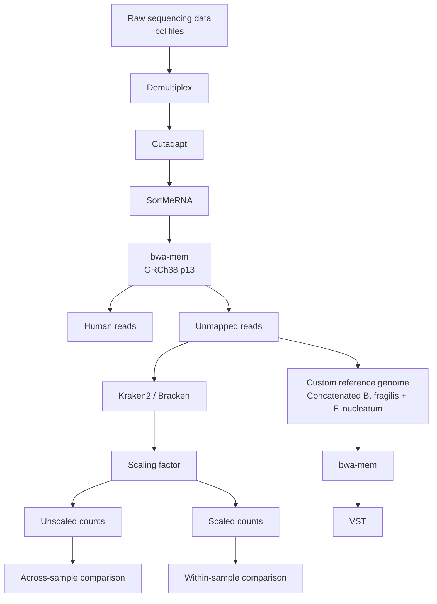

# BMEG 524 Final Project: Metatranscriptomic Analysis of Microbial Reads from Colorectal Cancer Patient Biopsies

Kvich, L. et al. Biofilms and core pathogens shape the tumor microenvironment and immune phenotype in colorectal cancer. Gut Microbes 16, 2350156 (2024). available here: [https://www.tandfonline.com/doi/full/10.1080/19490976.2024.2350156#d1e667](https://www.tandfonline.com/doi/full/10.1080/19490976

This project re-analyzes low-biomass mucosal biopsy RNA-seq data from the colorectal cancer (CRC) study by Kvich et al. to determine whether a more standard metatranscriptomic workflow can recover additional microbial community and functional insights beyond the original study, which primarily focused on the host RNA-seq signal. In this re-analysis, Kvich et al.'s microbial RNA-seq workflow is first reproduced to validate the published findings. The analysis is then extended with additional low-biomass preprocessing, broader taxonomic profiling, and community-wide functional pathway analysis to explore whether more discovery-oriented workflows can reveal microbial signals that were not accessible in the original study.

Main goals

Reproduce the published microbial findings from Kvich et al.

Benchmark the effect of extra preprocessing in low-biomass biopsy data

Extend the analysis to community-wide taxonomic and functional profiling

Identify CRC-associated microbial pathways using paired statistical models

Compare the strengths of targeted reference mapping vs discovery-oriented metatranscriptomic workflows

Tools used

bwa-mem

featureCounts

samtools / MultiQC / FastQC

KneadData

Kraken2 + Bracken

HUMAnN3

MaAsLin2

R (tidyverse, ggplot2, patchwork)

SLURM / UBC ARC Sockeye HPC

## GenAI Acknowledgement
- OpenAI. (2026). ChatGPT (April 13 version) [Large language model]. https://chatgpt.com/
- Anthropic. (2026). Claude Code (April 13 version) [Large language model]. https://claude.ai/